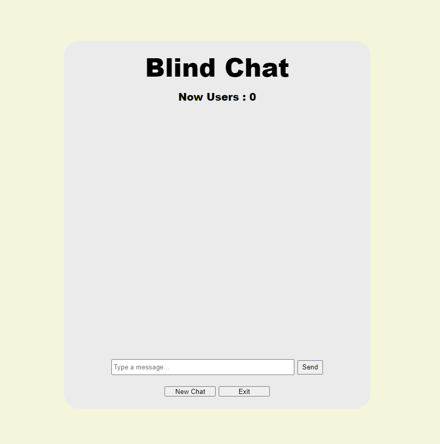
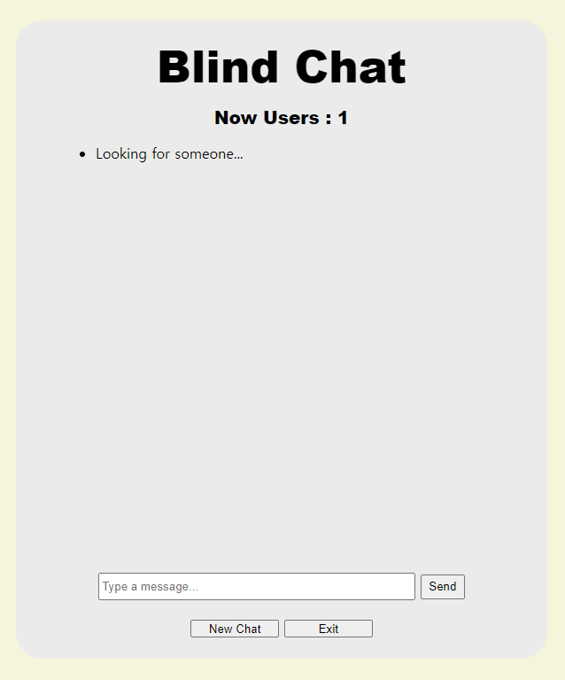
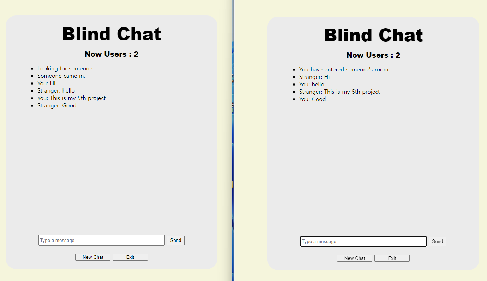
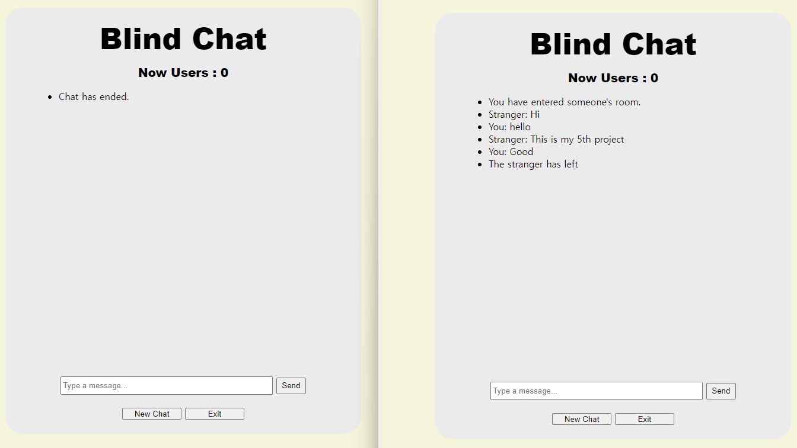

# Blind Chat (실시간 랜덤 매칭/채팅 사이트)
  
# 제작 기간(2024 . 02 . 07 ~ 2024 . 02 . 13)  / 개인 프로젝트 (다섯 번째 프로젝트) 

### 개발 환경 spring / thymeleaf / java / js,jquery  ++ websocket
   
### 주제 = 유저간 실시간으로 1:1 매칭 및 해당 유저간 실시간 채팅 사이트 구현 및 배포    
   
### 사이트 주소 = 
     

## 과정 및 후기
- **웹소켓 기술**을 기본부터 독학하는거라 어떤 방법을 써야할지부터 고민이 많았다. -> **sockJs과 srping 기본웹소켓** 중 후자를 선택(대부분 브라우저가 웹소켓을 지원하므로 성능면에서 선택)
- 유저별 **식별을 sessionId로 사용**하기로함 -> **웹소켓 세션과 서블릿세션**이 서로 다른 id를 사용하는걸 발견, 세션 통일을 위해 **interceptor에서 preHandShake**로 웹소켓연결시 서블릿세션의 sessionId를 넘겨주어 해결
- 전체 **방 관리 및 유저의 입,퇴장 관리** 방법 고민 -> **Map<String, Set<String>>를 사용**하기로함 Map <broker(구독방)이름, set<sessionId>>  
- 유저들의 **채팅 대기풀 / 1:1 매칭 시스템**을 위해 어떤방식을 써야할지 고민 -> broker를 매번 생성후 입,퇴장 유저가 subscribe와 disconnect를 반복하게하니 비효율적.    
  ㄴ> 모든유저가 **본인sessionId를 subscribe**, 이후 메세지를 상대방 sessionId와 본인sessionId를 **@DestinationVariable**로 항시 넘겨줌으로써 **같은 broker를 구독하지않아도 1:1채팅방이 형성**되게 만듦. 
- 현재 사이트 총 참여자 수를 **실시간 업데이트** 하기위한 방법 고민 -> **ajax**로 해당값을 받아와 **setInterval 로 매초 갱신**. (이때 문제가 발생)    
  ㄴ> ajax로 비동기 데이터 처리시 걸리는 시간때문에 알고리즘이 엉킴 -> **Promise를 사용해 해결**.

 
## 홈화면

ㄴ Now Users : 현재 채팅에 참여 중 이거나 채팅을 찾고있는 유저의 총 인원수   
ㄴ New Chat : 채팅할 방을 검색하기, 채팅중일시 끊고 다시 새 채팅방 검색

## 구동화면

ㄴ 대기풀에 등록되어 상대방을 찾고있는 화면   

ㄴ 상대방을 찾아 1:1 매칭이 되어 채팅을 하고 있는 화면   

ㄴ 채팅을 종료시 해당유저 화면(좌), 상대방 화면(우)

